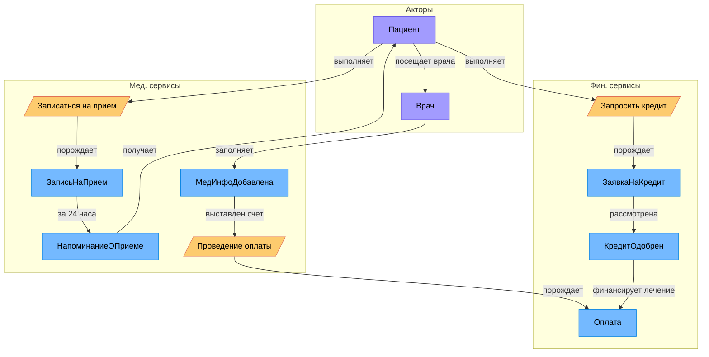

```mermaid
flowchart TB
    subgraph "Акторы"
        P["Пациент"]
        D["Врач"]
    end

    subgraph "Мед. сервисы"
        C1[/"Записаться на прием"/] 
        E1["ЗаписьНаПрием"]
        E2["НапоминаниеОПриеме"]
        E3["МедИнфоДобавлена"]
        C3[/"Проведение оплаты"/]
    end

    subgraph "Фин. сервисы"
        
        E5["ЗаявкаНаКредит"]
        C4[/"Запросить кредит"/]
        E6["КредитОдобрен"]
        E4["Оплата"]
    end

    P -->|"выполняет"| C1
    C1 -->|"порождает"| E1
    
    E1 -->|"за 24 часа"| E2
    E2 -->|"получает"| P
    
    P -->|"посещает врача"| D
    D -->|"заполняет"| E3
    
    E3 -->|"выставлен счет"| C3
    C3 -->|"порождает"| E4
    
    P -->|"выполняет"| C4
    C4 -->|"порождает"| E5
    E5 -->|"рассмотрена"| E6
    E6 -->|"финансирует лечение"| E4

    style P fill:#a29bfe,stroke:#6c5ce7,color:#000
    style D fill:#a29bfe,stroke:#6c5ce7,color:#000
    
    style C1 fill:#fdcb6e,stroke:#e17055,color:#000
    style C3 fill:#fdcb6e,stroke:#e17055,color:#000
    style C4 fill:#fdcb6e,stroke:#e17055,color:#000
    
    style E1 fill:#74b9ff,stroke:#0984e3,color:#000
    style E2 fill:#74b9ff,stroke:#0984e3,color:#000
    style E3 fill:#74b9ff,stroke:#0984e3,color:#000
    style E4 fill:#74b9ff,stroke:#0984e3,color:#000
    style E5 fill:#74b9ff,stroke:#0984e3,color:#000
    style E6 fill:#74b9ff,stroke:#0984e3,color:#000
```